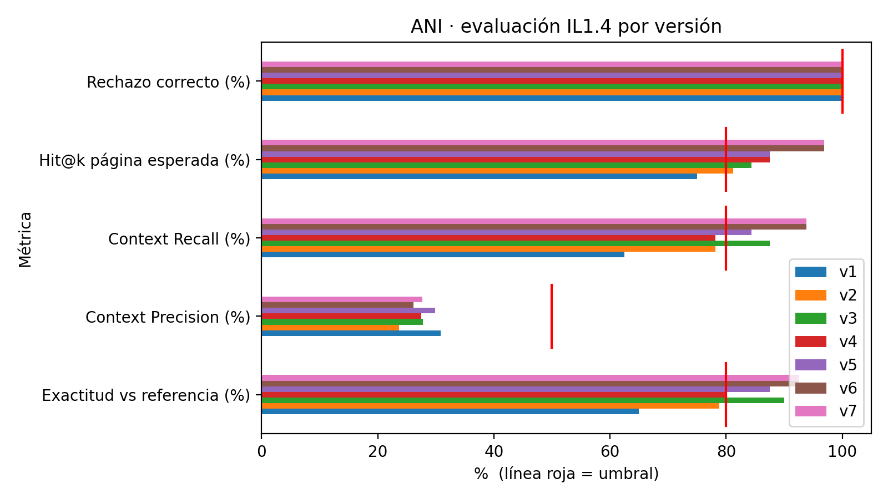

<p align="center">
  
</p>

# ANI · Asistente Normativo Institucional

Agente conversacional con **LLM + RAG** que responde las dudas de apoderados y apoderadas del **Liceo Polivalente Guillermo Labarca Hubertson** sobre tres documentos:

- *Reglamento de Evaluación y Promoción 2026*
- *Reglamento Interno de Convivencia Escolar 2026*
- *Decreto 67/2018 (MINEDUC)*

Cada respuesta cita el **documento, la ubicación (título, punto, protocolo o artículo) y la página**. Si algo no está en los documentos, ANI lo dice en vez de inventarlo.

> Proyecto de la asignatura **ISY0101 · Ingeniería de Soluciones con IA** (DUOC UC), desarrollado por **Felipe Villalobos** y **Adolfo Medina**.

---

## Cómo ejecutarlo

[](https://colab.research.google.com/github/felipits/ANI-asistente-normativo/blob/main/notebooks/P5_ANI_final.ipynb)

1. Haz clic en **Abrir en Colab** (arriba).
2. **Entorno de ejecución → Cambiar tipo de entorno de ejecución → T4 GPU → Guardar.**
3. Crea una clave gratuita de Gemini en [Google AI Studio](https://aistudio.google.com/apikey) y guárdala en el ícono 🔑 *Secretos* de Colab con el nombre `GEMINI_API_KEY`, con *Acceso al notebook* activado.
4. **Entorno de ejecución → Ejecutar todas.** Si Colab pide acceso a Google Drive, puedes aceptarlo o rechazarlo: si no encuentra una carpeta `ANI` en tu Drive, el notebook descarga los documentos desde este repositorio.
5. La celda 7 entrega un link `…gradio.live` con la interfaz, que funciona mientras Colab esté abierto.

*Ejecutar todas* solo prepara y abre ANI (unos minutos). La evaluación (celdas 9 y 10) viene desactivada; para volver a medir, cambia `EVALUAR = True` en la celda 1 (tarda ~30 min y gasta cuota de Gemini). Si no quieres ejecutarlo, los notebooks muestran sus salidas directamente en GitHub.

## Arquitectura

```
Pregunta del apoderado
   │  ocultamiento de RUT, correo y teléfono (Ley 21.719)
   ▼
Agente Gemini (function calling, memoria por conversación, modelos de respaldo)
   │  decide qué herramienta usar
   ├── buscar_norma_interna   → Reglamentos de Evaluación y Convivencia
   ├── buscar_norma_externa   → Decreto 67/2018
   ├── calcular_asistencia    → % de asistencia
   └── calcular_plazo_habil   → plazos en días hábiles (feriados de Chile)
   ▼
Buscador (RAG)
   multi-consulta (consulta del agente + pregunta original)
   → semántica (e5-small + ChromaDB) + léxica (BM25) + preguntas hipotéticas, fusión RRF
   → reranker cross-encoder → anti-duplicados → contexto ampliado a la sección
   ▼
Respuesta con cita (documento · ubicación · página) + 👍/👎 con comentario
```

| Componente | Implementación |
|---|---|
| Fragmentación | PyMuPDF por sección, artículo, punto o protocolo. Fragmentos de 800 caracteres con solape de 150 (divisor recursivo), cada uno con su **página exacta** |
| Preguntas hipotéticas | *doc2query*: 3 preguntas tipo apoderado por fragmento (3.057 en total), generadas una vez con Gemini |
| Recuperación | Híbrida (semántica + BM25 + preguntas hipotéticas) con fusión RRF, reranker `mmarco-mMiniLMv2-L12`, anti-duplicados y expansión padre-hijo |
| Controles | búsqueda obligatoria, re-búsqueda antes de responder "no está regulado", ocultamiento de datos personales y panel de trazabilidad |
| Interfaz | Gradio con colores y logos del liceo, fuentes desplegables, preguntas frecuentes por tema y 👍/👎 con comentario (revisión de UTP) |

## Iteraciones

| Notebook | Autor | Versión | Cambio principal |
|---|---|---|---|
| [P1](notebooks/P1_prototipo_agente.ipynb) | Felipe | v1 | Prototipo: fragmentos, ChromaDB, agente con 4 herramientas e interfaz Gradio |
| [P2](notebooks/P2_evaluacion_IL14.ipynb) | Adolfo | (mide v1) | Evaluación automática con 40 preguntas y juez LLM (criterios IL1.4) |
| [P3a](notebooks/P3a_mejoras_recuperacion_v2_v3.ipynb) | Felipe | v2 – v3 | Búsqueda híbrida, multi-consulta, reranker, re-búsqueda antes de rechazar, interfaz final |
| [P3b](notebooks/P3b_notebook_limpio_v4_v5.ipynb) | Felipe | v4 – v5 | Notebook limpio + ajuste léxico (caso "atrasos") |
| [P4](notebooks/P4_paginas_exactas_doc2query_v6.ipynb) | Adolfo | v6 | Páginas exactas, preguntas hipotéticas, anti-duplicados y contexto ampliado |
| [P5](notebooks/P5_ANI_final.ipynb) | Felipe y Adolfo | v7 | Versión final: etiqueta de protocolos corregida y medición con GPU |

El detalle de cada iteración, con el diagnóstico que motivó cada cambio, está en **[docs/BITACORA.md](docs/BITACORA.md)**.

## Resultados

Evaluación con 40 preguntas (32 con respuesta en los documentos y 8 que deben rechazarse), usando un LLM juez a temperatura 0.

| Métrica | Umbral | v1 | v2 | v3 | v4 | v5 | v6 | v7 |
|---|---|---|---|---|---|---|---|---|
| Exactitud vs referencia (%) | 80 | 65,0 | 78,8 | 90,0 | 80,0 | 87,5 | 92,5 | **92,5** |
| Fidelidad (/10) | 8 | 7,6 | 9,6 | 9,8 | 9,4 | 9,8 | 9,8 | **9,8** |
| Relevancia (/10) | 8 | 8,9 | 9,3 | 9,6 | 9,4 | 9,6 | 9,7 | **9,7** |
| Context Precision (%) | 50 | 30,8 | 23,7 | 27,8 | 27,5 | 29,9 | 26,2 | **27,7** |
| Context Recall (%) | 80 | 62,5 | 78,1 | 87,5 | 78,1 | 84,4 | 93,8 | **93,8** |
| Hit@k página esperada (%) | 80 | 75,0 | 81,2 | 84,4 | 87,5 | 87,5 | 96,9 | **96,9** |
| Rechazo correcto (%) | 100 | 100 | 100 | 100 | 100 | 100 | 100 | **100** |

**Context Precision** queda bajo el umbral en todas las versiones porque el buscador entrega varios fragmentos para asegurar que el dato llegue (recall). En P3a (Paso 21) se simuló un corte por puntaje del reranker y ningún corte llegó a 50 % sin perder recall, así que se priorizó no omitir información.

Con GPU T4, la latencia mediana de v7 fue de **19,2 s** por respuesta (v6 sin GPU: 36,8 s).



Los archivos de cada medición están en [`evaluacion/`](evaluacion/) y el set de 40 preguntas en [`ANI/`](ANI/).

## Estructura

```
├── ANI/             documentos fuente (PDF), logos, preguntas hipotéticas y set de prueba
├── notebooks/       P1 a P5 (P5 es el ejecutable)
├── evaluacion/      resultados de cada versión y gráfico comparativo
├── docs/            bitácora de iteraciones
└── requirements.txt
```

## Privacidad y seguridad

- La clave de Gemini se lee desde los Secretos de Colab y no aparece en ningún archivo.
- Antes de enviar la pregunta a Gemini se ocultan RUT, correos y teléfonos.
- Los votos 👍/👎 se guardan en `ANI_feedback.csv` y no se publican en este repositorio.
